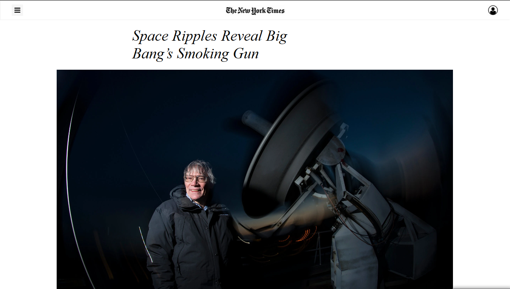
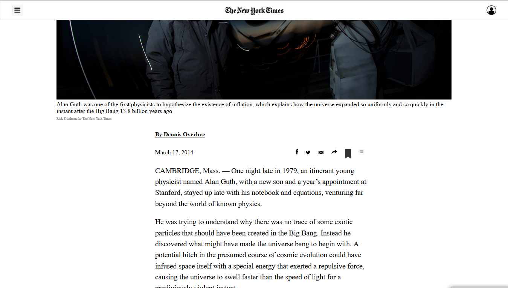
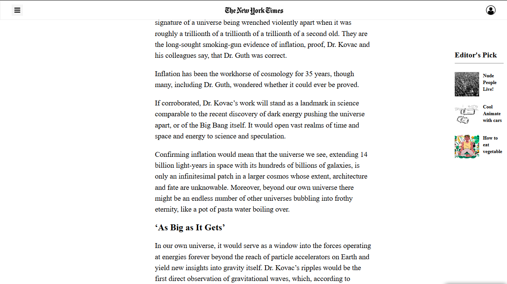
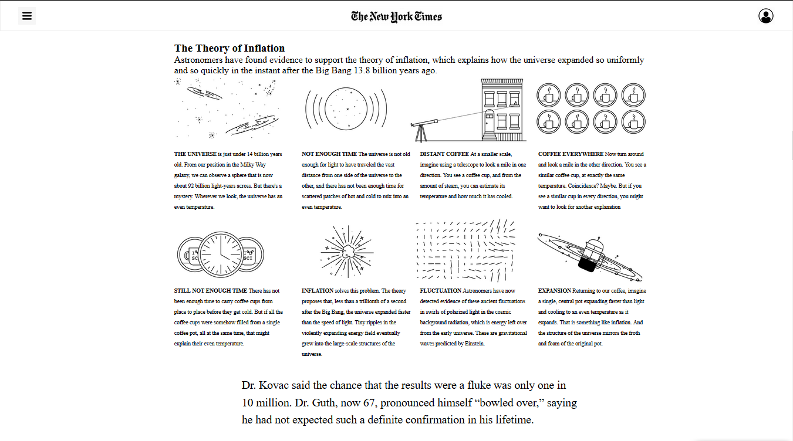
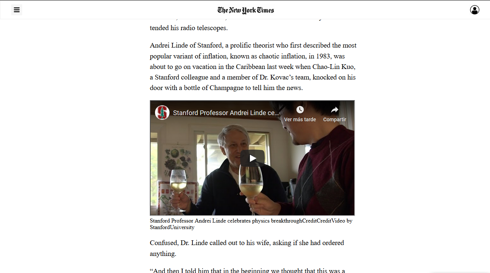
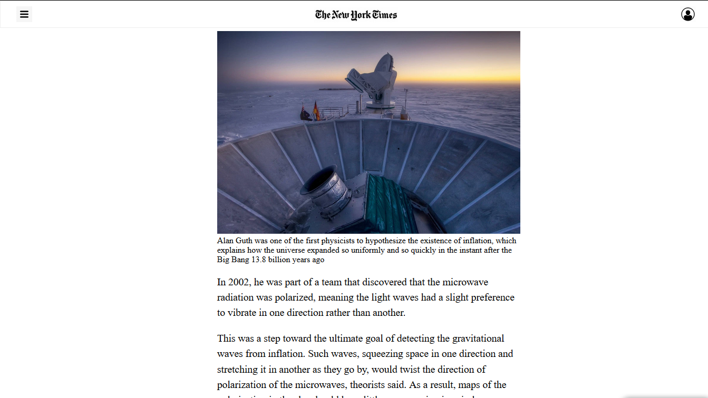
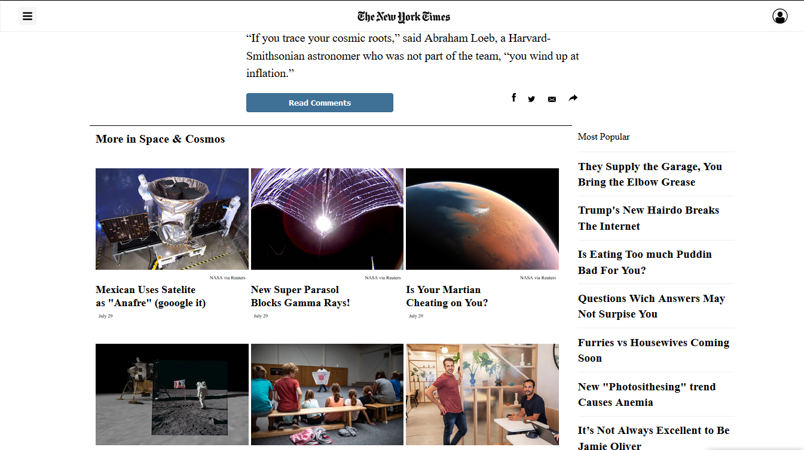
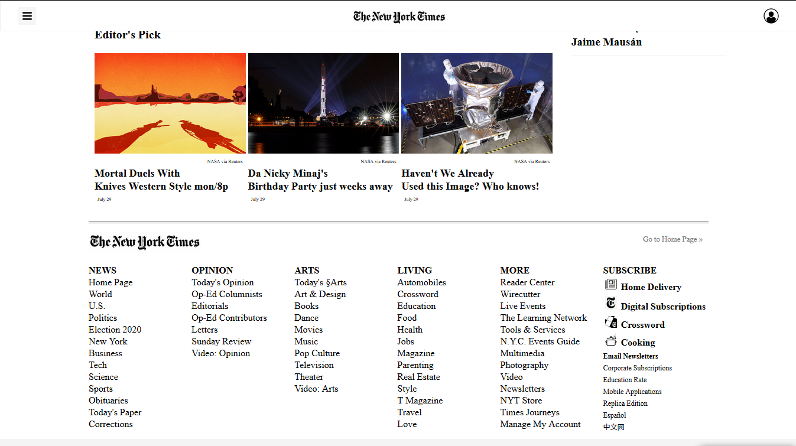

# positioning-and-floating-elements

# Positioning and Floating Elements
### New York Times Clone page
#### By: [Sebastian Lujan](https://github.com/sebastianlujan) and [Eduardo 'Usagi' Bonilla](https://github.com/usagib)
---
The New York Times has been a leader in experimenting with the inclusion of multimedia content in traditional stories. That creates all kinds of interesting position questions.

This project consists of making a clone of a New York Times article page. using familiar concepts such as:

..*Embedding images
..*Working with forms (buttons in this case)
..*Floats and positioning
..*The box model

[The Odin Project - Specifications](https://www.theodinproject.com/courses/html5-and-css3/lessons/positioning-and-floating-elements)

### Screenshot!

Don't forget to visit the [LIVE DEMO](https://usagib.github.io/nytclone)
